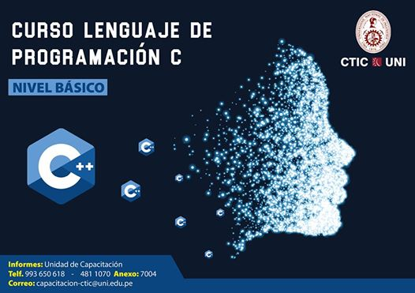

Lenguaje de Programación C - Nivel Básico
===

  

**Instructor**: [MSc. César Manuel Sebastián Díez Chirinos](http://dina.concytec.gob.pe/appDirectorioCTI/VerDatosInvestigador.do;jsessionid=fd6624fe7d9f148aabe8445c1992?id_investigador=24012)

**E-mail :email:**: [cdiezch@uni.edu.pe](mailto:cdiezch@uni.edu.pe)

**Aula**: Laboratorio N°4 del [Centro de Tecnologías de la Información y Comunicaciones](http://www.ctic.uni.edu.pe/) de la [Universidad Nacional de Ingeniería](http://www.uni.edu.pe/).

**Horario**: Los días viernes desde las 10:30 hrs hasta 13:00 hrs.

**Requisito mínimo para no ser penalizado**: *80% de asistencia* de las clases totales.

## Cronograma de clases

|   Sesión  |   Fecha   |   Temas   |
|:---------:|:---------:|:---------:|
| 1 | 01/06/2018 | [Introducción a C, la historia de C y las 7 partes de un programa](https://github.com/carlosal1015/C-Programming/tree/master/Sessions/First). |
| 2 | 08/06/2018 | [Data and C](https://github.com/carlosal1015/C-Programming/tree/master/Sessions/Second)|
| 3 | 15/06/2018 | [Character strings and Formatted I/O](https://github.com/carlosal1015/C-Programming/tree/master/Sessions/Third)|
| 4 | 22/06/2018 | [Operators, Expressions, and Statements](https://github.com/carlosal1015/C-Programming/tree/master/Sessions/Fourth)|
| 5 | 06/07/2018 | [Proyecto Mitad de Curso, ejercicio FIFA World Cup 2018](https://github.com/carlosal1015/C-Programming/tree/master/Sessions/Fifth) |
| 6 | 13/07/2018 | [Loopings](https://github.com/carlosal1015/C-Programming/tree/master/Sessions/Sixth) |
| 7 | 13/08/2018 | [Branching and Jumping](https://github.com/carlosal1015/C-Programming/tree/master/Sessions/Seventh)| |
| 8 | 14/08/2018 | 
| 9 | 15/08/2018 |  |