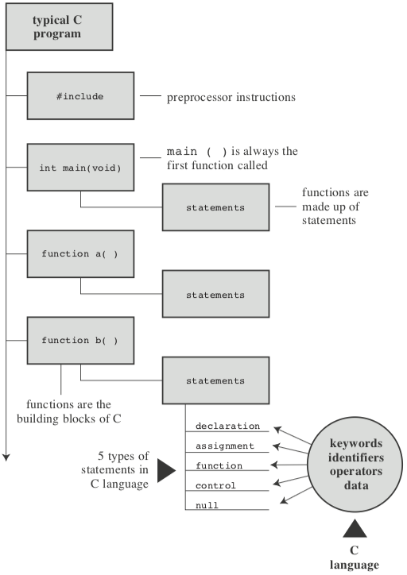
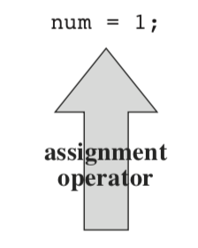
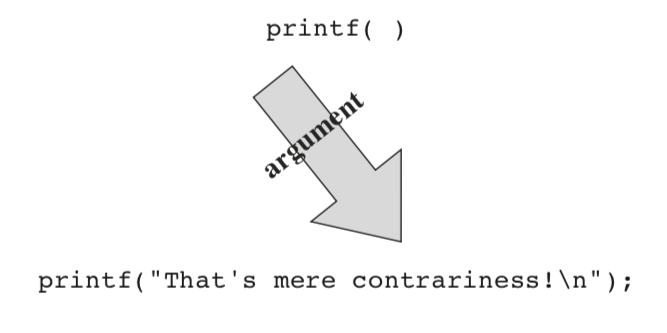
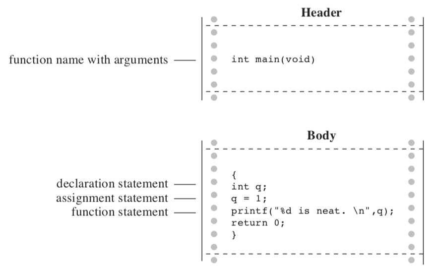
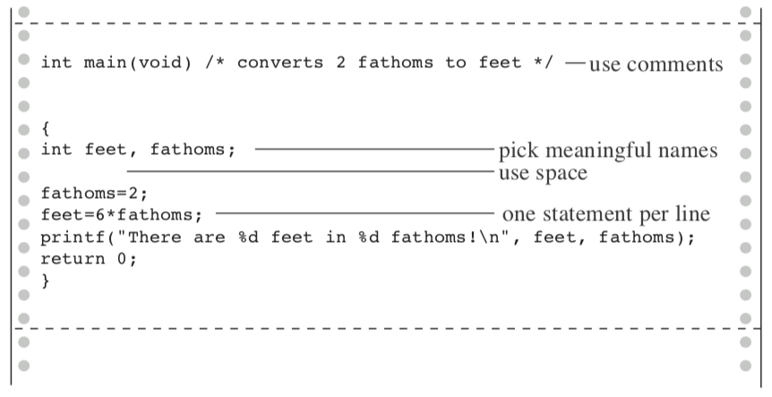

Introducción a C
===

Aprenderá sobre lo siguiente en este capítulo:
* Operador: `=`
* Funciones: `main()`, `printf()`
* Armar un simple programa en C
* Crear variables de valores enteros, asignarles valores y mostrar esos valores en la pantalla
* El carácter de nueva línea
* Cómo incluir comentarios en sus programas, crear programas que contengan más de una función y encontrar errores de programa
* Qué son las palabras clave

¿Cómo se ve un programa C? Si hojeas este libro, verás muchos ejemplos. Es muy probable que veas que C se ve un poco peculiar, salpicado de símbolos como
`{`, `cp->tort`, y `*ptr++`. A medida que lea este libro, sin embargo, descubrirá que la apariencia de estos y otros símbolos C característicos se vuelve menos extraña, más familiar y tal vez incluso bienvenida. O bien, si ya está familiarizado con uno de los muchos descendientes de C, es posible que sienta que está llegando a la fuente. En este capítulo, comenzamos presentando un programa de muestra simple y explicando lo que hace. Al mismo tiempo, destacamos algunas de las características básicas de C.

#### Un ejemplo simple de C

Echemos un vistazo a un simple programa C. Este programa, que se muestra en el Listado 2.1, sirve para señalar algunas de las características básicas de la programación en C. Antes de leer la siguiente explicación línea por línea del programa, lea el Listado 2.1 para ver si puede averiguar por usted mismo lo que hará

```c
#include <stdio.h>
int main(void)					/*	a simple program			*/
{
    int num;					/*	define a variable called num*/
    num = 1;					/*	assign a value to num		*/

	printf("I am a simple ");	/*	use the printf() function	*/
	printf("computer.\n");
	printf("My favorite number is %d because it is first.\n",num);

	return 0;
}
```

Si crees que este programa imprimirá algo en tu pantalla, ¡tienes razón! Exactamente lo que se imprimirá podría no ser aparente, por lo tanto, ejecute el programa y vea los resultados. Primero, use su editor favorito (o el editor favorito de su compilador) para crear un archivo que contenga el texto del Listado 2.1. Déle un nombre al archivo que termine en `.c` y que satisfaga los requisitos de nombre de su sistema local. Puede usar `first.c`, por ejemplo. Ahora compile y ejecute el programa. (Consulte el Capítulo 1, "Preparándose", para obtener algunas pautas generales para este proceso). Si todo salió bien, la salida debería ser similar a la siguiente:

```bash
I am a single computer.
My favorite number is 1 because it is first.
```

En general, este resultado no es demasiado sorprendente, pero ¿qué pasó con el `\n`s y el `%d` en el programa? Y algunas de las líneas del programa parecen extrañas. Es hora de una explicación.

> **Ajustes de programa**
> ¿La salida de este programa parpadea brevemente en la pantalla y luego desaparece? Algunos entornos de ventanas ejecutan el programa en una ventana separada y luego cierran automáticamente la ventana cuando finaliza el programa. En este caso, puede proporcionar un código adicional para que la ventana permanezca abierta hasta que toque una tecla. Una forma es agregar la siguiente línea antes de la declaración de devolución:

```c
getchar ();
```

> Este código hace que el programa espere una pulsación de tecla, por lo que la ventana permanece abierta hasta que presione una tecla. Aprenderá más acerca de `getchar()` en el Capítulo 8, "Entrada/salida de caracteres y validación de entrada".

#### El ejemplo explicado

Tomaremos dos pasos a través del código fuente del programa. El primer paso ("Paso 1: Sinopsis rápida") resalta el significado de cada línea para ayudarlo a tener una idea general de lo que está sucediendo en. El segundo paso ("Paso 2: Detalles del programa") explora las implicaciones y detalles específicos para ayudarlo a obtener una comprensión más profunda.

La Figura 2.1 resume las partes de un programa C; incluye más elementos de los que nuestro primer ejemplo usa.

<p align="center">
  
</p>

#### Paso 1: Sinopsis rápida

Esta sección presenta cada línea del programa seguida de una breve descripción; la siguiente sección (Paso 2) explora los temas planteados aquí más completamente.

```c
#include <stdio.h>			incluye otro archivo
```

Esta línea le dice al compilador que incluya la información que se encuentra en el archivo `stdio.h`, que es una parte estándar de todos los paquetes del compilador de C; este archivo proporciona soporte para entrada de teclado y para mostrar salida.

```c
int main (void)				􏰀un nombre de función
```

Los programas C consisten en una o más funciones, los módulos básicos de un programa C. Este programa consiste en una función llamada `main`. Los paréntesis identifican `main()` como un nombre de función. El `int` indica que la función `main()` devuelve un entero, y el `void` indica que `main()` no toma ningún argumento. Estos son asuntos que analizaremos más adelante. En este momento, simplemente acepte tanto `int` como `void` como parte de la forma estándar de ANSI C para definir `main()`. (Si tiene un compilador anterior a ANSI C, omita el `void`; es posible que desee obtener algo más reciente para evitar incompatibilidades).

```c
/* un programa simple */	<- un comentario
```

Los símbolos `/*` y `*/` encierra comentarios de observaciones que ayudan a aclarar un programa. Están destinados solo para el lector y son ignorados por el compilador.

```c
{		<- 􏰀inicio del cuerpo de la función
```

Esta llave de apertura marca el comienzo de las declaraciones que componen la función. Una llave de clausura (`}`) marca el final de la definición de la función.

```c
int num;		<- una declaración de asignación
```

Esta declaración anuncia que está usando una variable llamada `num` y que `num` será un tipo `int` (entero).

```c
num = 1;		<- 􏰀una declaración de asignación
```

La declaración `num = 1;` asigna el valor 1 a la variable llamada `num`.

```c
printf ("Soy un simple");	<- una declaración de llamada a una función
```

La primera instrucción que usa `printf()` muestra la frase `I am a simple` en su pantalla, dejando el cursor en la misma línea. Aquí `printf()` es parte de la biblioteca estándar de C. Se denomina *función*, y el uso de una función en el programa se denomina llamar a una función.

```c
printf ("computer.\n");		<- otra declaración de llamada a una función
```

La siguiente llamada a la función `printf()` se pega en la computadora al final de la última frase impresa. El `\n` es un código que le dice a la computadora que debe comenzar una nueva línea, es decir, mover el cursor al comienzo de la siguiente línea.

```c
printf ("My favorite number is %d because it is first.\n", num);
```

El último uso de `printf()` imprime el valor de `num` (que es 1) incrustado en la frase entre comillas. El `%d` indica a la computadora dónde y de qué forma imprimir el valor de `num`.

```c
return 0;		<- una declaración de devolución
```

Una función C puede proporcionar, o *devolver*, un número a la agencia que lo usó. Por el momento, solo considere esta línea como el cierre apropiado para una función `main()`.

```c
}		<- 􏰀el final
```

Según lo prometido, el programa termina con una llave de clausura.

#### Pase 2: Detalles del programa

Ahora que tiene una visión general del Listado 2.1, lo analizaremos más de cerca. Una vez más, examinaremos las líneas individuales del programa, esta vez utilizando cada línea de código como punto de partida para profundizar en los detalles detrás del código y como base para desarrollar una perspectiva más general de las características de programación C.


#### #include directivas y archivos de encabezado

```c
#include <stdio.h>
```

Esta es la línea que comienza el programa. El efecto de `#include <stdio.h>` es el mismo que si había escrito todo el contenido del archivo `stdio.h` en su archivo en el punto donde aparece la línea `#include`. En efecto, es una operación de cortar y pegar. Los archivos `include` brindan una forma conveniente de compartir información que es común a muchos programas.

La instrucción `#include` es un ejemplo de una *directiva de preprocesador C*. En general, los compiladores de C realizan algunos trabajos preparatorios sobre el código fuente antes de compilar; esto se denomina *preprocesamiento*.

El archivo `stdio.h` se suministra como parte de todos los paquetes del compilador de C. Contiene información sobre las funciones de entrada y salida, como `printf()`, para que el compilador la use. El nombre significa *encabezado de entrada/salida estándar*. Las personas que usan C llaman a una colección de información que va en la parte superior de un archivo un *encabezado*, y las implementaciones C generalmente vienen con varios archivos de encabezado.

En su mayor parte, los archivos de encabezado contienen información utilizada por el compilador para construir el programa ejecutable final. Por ejemplo, pueden definir constantes o indicar los nombres de las funciones y cómo se deben usar. Pero el código real para una función está en un archivo de biblioteca de código precompilado, no en un archivo de encabezado. El componente enlazador del compilador se encarga de encontrar el código de la biblioteca que necesita. En resumen, los archivos de cabecera ayudan a guiar al compilador a organizar su programa correctamente.

ANSI/ISO C ha estandarizado qué archivos de cabecera debe tener disponible un compilador de C. Algunos programas deben incluir `stdio.h`, y otros no. La documentación para una implementación de C particular debe incluir una descripción de las funciones en la biblioteca de C. Estas descripciones de funciones identifican qué archivos de encabezado son necesarios. Por ejemplo, la descripción para `printf()` dice usar `stdio.h`. Omitir el archivo de encabezado adecuado puede no afectar un programa en particular, pero es mejor no confiar en eso. Cada vez que este libro usa funciones de biblioteca, utilizará los archivos de inclusión especificados por el estándar ANSI/ISO para esas funciones.

> Nota Por qué la entrada y la salida no están integradas

> Tal vez se pregunte por qué las funciones tan básicas como la entrada y la salida no se incluyen automáticamente. Una respuesta es que no todos los programas usan este paquete de E/S (entrada/salida), y parte de la filosofía C es evitar cargar un peso innecesario. Este principio de uso económico de los recursos hace que C sea popular para la programación integrada, por ejemplo, escribir código para un chip que controla un sistema de combustible automotriz o un reproductor de Blu-ray. Por cierto, la línea `#include` ni siquiera es una declaración en C! El símbolo # en la columna 1 identifica la línea como una a ser manejada por el preprocesador C antes de que el compilador se haga cargo. Encontrará más ejemplos de instrucciones del preprocesador más adelante, y el Capítulo 16, "El preprocesador C y la biblioteca C", trata este tema más a fondo.

#### La función `main()`
```c
int main (void)
```

La siguiente línea del programa proclama una función con el nombre de `main`. Es cierto que `main` es un nombre bastante simple, pero es la única opción disponible. Un programa C (con algunas excepciones de las que no nos preocuparemos) siempre comienza la ejecución con la función llamada `main()`. Usted es libre de elegir nombres para otras funciones que use, pero `main()` debe estar allí para comenzar. ¿Qué pasa con los paréntesis? Identifican `main()` como una función. Aprenderá más sobre las funciones pronto. Por ahora, solo recuerda que las funciones son los módulos básicos de un programa C.

El `int` es el tipo de devolución de la función `main()`. Eso significa que el tipo de valor que `main()` puede devolver es un entero. ¿Dónde devolver? Para el sistema operativo, volveremos a esta pregunta en el Capítulo 6, "C Sentencias de control: bucle".

Los paréntesis que siguen un nombre de función generalmente incluyen información que se transmite a la función. Para este simple ejemplo, no se pasa nada, por lo que los paréntesis contienen la palabra `void`. (El Capítulo 11, "Cadenas de caracteres y funciones de cadenas", presenta un segundo formato que permite que la información pase a `main()` desde el sistema operativo).

Si navega por el antiguo código C, a menudo verá programas que comienzan con el siguiente formato:

```c
main()
```

El estándar C90 tolera de mala gana esta forma, pero los estándares C99 y C11 no lo hacen. Entonces, incluso si su compilador actual le permite hacer esto, no lo haga.

La siguiente es otra forma que puede ver:

```c
void main()
```

Algunos compiladores lo permiten, pero ninguno de los estándares lo ha incluido como una opción reconocida. Por lo tanto, los compiladores no tienen que aceptar este formulario, y otros no. De nuevo, mantente en la forma estándar, y no se encontrará con problemas si mueve un programa de un compilador a otro.

#### Comentarios
```c
/* un programa simple */
```

Las partes del programa incluidas en los símbolos `/*` `*/` son comentarios. El uso de comentarios hace que sea más fácil para alguien (incluido usted) entender su programa. Una buena característica de los comentarios de C es que pueden colocarse en cualquier lugar, incluso en la misma línea que el material que explican. Un comentario más largo puede colocarse en su propia línea o incluso distribuirse en más de una línea. Todo entre la apertura `/*` y el cierre `*/` es ignorado por el compilador. Los siguientes son algunos formularios de comentarios válidos y no válidos:

```c
/* Este es un comentario en C. */
/* Este comentario, siendo algo prolijo, se extiende por
dos lineas. */

/*
	Usted puede hacer esto, también.
*/
/* Pero esto no es válido porque no hay un marcador final.
```

C99 agregó un segundo estilo de comentarios, uno popularizado por C++ y Java. El nuevo estilo usa los símbolos `//` para crear comentarios que están confinados a una sola línea:

```c
// Aquí hay un comentario limitado a una línea.
int rigue;		// Tales comentarios pueden ir aquí también.
```

Como el final de la línea marca el final del comentario, este estilo necesita marcadores de comentarios justo al comienzo del comentario.

La forma más nueva es una respuesta a un posible problema con la forma anterior. Supongamos que tiene el siguiente código:

```c
/*
Espero que esto funcione.
*/
x = 100;
y = 200;
/* Ahora para algo más. */
```

Luego, suponga que decide eliminar la cuarta línea y accidentalmente elimina la tercera línea (el `*/`) también. El código luego se convierte

```c
/*
Espero que esto funcione.
y = 200;
/* Ahora para algo más. */
```

Ahora el compilador combina el `/*` en la primera línea con el `*/` en la cuarta línea, haciendo que las cuatro líneas en un solo comentario, incluida la línea que se suponía que era parte del código. Debido a que `//` el formulario no se extiende a más de una línea, no puede llevar a este problema de "desaparición del código".

Algunos compiladores pueden no admitir esta característica; otros pueden requerir cambiar la configuración del compilador para habilitar las funciones C99 o C11.

Este libro, que opera bajo la teoría de que la coherencia innecesaria puede ser aburrida, usa ambos tipos de comentarios.

#### Llaves, cuerpos y bloques
```c
{
...
}
```

En el Listado 2.1, las llaves delimitaban la función `main()`. En general, todas las funciones de C usan llaves para marcar el comienzo y el final del cuerpo de una función. Su presencia es obligatoria, así que no los dejen fuera. Solo las llaves (`{	}`) funcionan para este propósito, no entre paréntesis (`(	)`) y no entre corchetes (`[	]`).

Las llaves también se pueden usar para reunir declaraciones dentro de una función en una unidad o bloque. Si está familiarizado con Pascal, ADA, Modula-2 o Algol, reconocerá que las llaves son similares a las de inicio y fin en esos idiomas.

#### Declaraciones
```c
int num;
```

Esta línea del programa se denomina sentencia de declaración. La sentencia de declaración es una de las características más importantes de C. Este ejemplo particular declara dos cosas. Primero, en algún lugar de la función, tienes una *variable* llamada `num`. Segundo, el `int` proclama `num` como un entero, es decir, un número sin un punto decimal o una parte fraccionaria. (`int` es un ejemplo de un *tipo de dato*.) El compilador usa esta información para organizar el espacio de almacenamiento adecuado en la memoria para la variable num. El punto y coma al final de la línea identifica la línea como una instrucción o instrucción C. El punto y coma es parte del enunciado, no solo un separador entre enunciados como lo es en Pascal.

La palabra `int` es una *palabra clave* de C que identifica uno de los tipos básicos de datos C. Las palabras clave son las palabras utilizadas para expresar un idioma y no puede usarlas para otros fines. Por ejemplo, no puede usar `int` como el nombre de una función o una variable. Sin embargo, estas restricciones de palabras clave no se aplican fuera del idioma, por lo que está bien nombrar un gato o un niño favorito `int`. (La costumbre o la ley local pueden anular esta opción en algunas configuraciones regionales).

La palabra `num` en este ejemplo es un *identificador*, es decir, un nombre que seleccione para una variable, una función o alguna otra entidad. Entonces la declaración conecta un identificador particular con una ubicación particular en la memoria de la computadora, y también establece el tipo de información, o tipo de datos, que se almacenará en esa ubicación.

En C, todas las variables deben declararse antes de ser utilizadas. Esto significa que debe proporcionar listas de todas las variables que usa en un programa y que debe mostrar qué tipo de datos es cada variable. Declarar variables se considera una buena técnica de programación y, en C, es obligatorio.

Tradicionalmente, C ha requerido que las variables se declaren al comienzo de un bloque sin ningún otro tipo de declaración permitida antes de cualquiera de las declaraciones. Es decir, el cuerpo de main () podría tener el siguiente aspecto:

```c
int main ()		// reglas tradicionales
{
	int doors;
	int dogs;
	doors = 5;
	dogs = 3;
	// otras declaraciones
}
```

C99 y C11, siguiendo la práctica de C++, le permiten colocar declaraciones sobre cualquier parte de un bloque. Sin embargo, todavía debe declarar una variable antes de su primer uso. Entonces, si su compilador admite esta característica, su código puede verse como el siguiente:

```c
int main ()		// reglas actuales de C
{
// algunas declaraciones
	int doors;
	doors = 5;	// primer uso de puertas
// más declaraciones
	int dogs;
	dogs = 3;	// primer uso de perros
	// otras declaraciones
}
```

Para una mayor compatibilidad con sistemas antiguos, este libro se apegará a la convención original.

En este punto, probablemente tengas tres preguntas. Primero, ¿qué son los tipos de datos? En segundo lugar, ¿qué opciones tiene para seleccionar un nombre? Tercero, ¿por qué tienes que declarar las variables? Veamos algunas respuestas.

#### Tipos de datos

C trata con varios tipos (o tipos) de datos: enteros, caracteres y punto flotante, por ejemplo. Declarar que una variable es un número entero o un tipo de carácter permite que la computadora almacene, extraiga e interprete los datos correctamente. Investigarás la variedad de tipos disponibles en el próximo capítulo.

#### Elección del nombre

Debe usar nombres significativos (o identificadores) para variables (como `sheep_count` en lugar de `x3` si su programa cuenta ovejas). Si el nombre no es suficiente, use comentarios para explicar lo que representan las variables. Documentar un programa de esta manera es una de las técnicas básicas de una buena programación.

Con C99 y C11 puede crear el nombre de un identificador tan largo como desee, pero el compilador solo necesita considerar los primeros 63 caracteres como significativos. Para los identificadores externos (consulte el Capítulo 12, "Clases de almacenamiento, enlace y gestión de memoria"), solo se deben reconocer 31 caracteres. Este es un aumento sustancial del requisito de C90 de 31 caracteres y seis caracteres, respectivamente, y los compiladores de C más antiguos a menudo se detienen en ocho caracteres como máximo. En realidad, puede usar más que la cantidad máxima de caracteres, pero el compilador no está obligado a prestar atención a los caracteres adicionales. ¿Qué significa esto? Si tiene dos identificadores, cada uno de 63 caracteres de largo e idéntico, excepto un carácter, el compilador debe reconocerlos como distintos entre sí. Si tiene dos identificadores de 64 caracteres de largo e idénticos, excepto el carácter final, el compilador podría reconocerlos como distintos o no; el estándar no define lo que debería suceder en ese caso.

Los caracteres a su disposición son letras minúsculas, letras mayúsculas, dígitos y el guión bajo (`_`). El primer carácter debe ser una letra o un guión bajo. Los siguientes son algunos ejemplos:

| Nombres válidos | Nombres inválidos |
|:---------------:|:-----------------:|
| `wiggles` | `$ZJ**` |
| `cat2` | `2cat` |
| `Hoy_Tub` | `Hot-Tub` |
| `taxRate` | `tax rate` |
| `_kcab` | `don't` |

Los sistemas operativos y la biblioteca C a menudo usan identificadores con uno o dos caracteres de subrayado iniciales, como en `_kcab`, por lo que es mejor evitar ese uso usted mismo. Las etiquetas estándar que comienzan con uno o dos caracteres de subrayado, como los identificadores de biblioteca, están reservadas. Esto significa que aunque no es un error de sintaxis usarlos, podría generar conflictos de nombres.

Los nombres C distinguen entre mayúsculas y minúsculas, lo que significa que una letra mayúscula se considera distinta de la letra minúscula correspondiente. Por lo tanto, `stars` son diferentes de `Stars` y `STARS`.

Para que C sea más internacional, C99 y C11 hacen que un amplio conjunto de caracteres esté disponible para ser utilizado por el mecanismo de Nombres de Caracteres Universales (o UMC). La Sección de referencia VII, "Soporte ampliado de caracteres", en el Apéndice B, analiza esta adición. Esto pone a disposición personajes que no son parte del alfabeto inglés.

#### Cuatro buenas razones para declarar variables

Algunos lenguajes antiguos, como las formas originales de FORTRAN y BASIC, le permiten usar variables sin declararlas. Entonces, ¿por qué no puedes tomar este enfoque sencillo en C? Aquí hay algunas razones:

* Colocar todas las variables en un solo lugar hace que sea más fácil para un lector comprender de qué se trata el programa. Esto es particularmente cierto si le da a sus variables nombres significativos (como `taxrate` en lugar de `r`). Si el nombre no es suficiente, use comentarios para explicar lo que representan las variables. Documentar un programa de esta manera es una de las técnicas básicas de una buena programación.
* Pensar en qué variables declarar lo alienta a planificar un poco antes de sumergirse en la escritura de un programa. ¿Qué información necesita el programa para comenzar? ¿Qué es exactamente lo que quiero que el programa produzca como salida? ¿Cuál es la mejor manera de representar los datos?
* La declaración de variables ayuda a prevenir uno de los errores más sutiles y difíciles de encontrar de la programación: el del nombre de la variable mal escrito. Por ejemplo, supongamos que en algún idioma que carece de declaraciones, usted hizo la afirmación

```c
RADIUS1 = 20.4;
```

y que en otra parte del programa escribiste mal

```
CIRCUM = 6.28 * RADIUSl;
```

Inconscientemente reemplazaste el número 1 con la letra l (el minúsculo). Ese otro lenguaje crearía una nueva variable llamada RADIUSl y usaría cualquier valor que tuviera (tal vez cero, tal vez basura). A CIRCUM se le daría un valor incorrecto, y es posible que tenga un montón de tiempo tratando de descubrir por qué. Esto no puede suceder en C (a menos que haya sido lo suficientemente tonto como para declarar dos nombres de variables similares) porque el compilador se quejará cuando se muestre el RADIUSl no declarado.

* Su programa C no se compilará si no declara sus variables. Si las razones anteriores no lo conmueven, debe pensar seriamente en esto.

Dado que necesita declarar sus variables, ¿a dónde van? Como se mencionó anteriormente, C antes de C99 se requiere que las declaraciones vayan al comienzo de un bloque. Una buena razón para seguir esta práctica es que al agrupar las declaraciones, es más fácil ver qué está haciendo el programa. Por supuesto, también hay una buena razón para difundir sus declaraciones, como ahora permite C99. La idea es declarar las variables justo antes de que esté listo para darles un valor. Eso hace que sea más difícil olvidar darles un valor. Como cuestión práctica, muchos compiladores aún no admiten la regla C99.

#### Asignación
```c
num = 1;
```

La siguiente línea de programa es una *declaración de asignación*, una de las operaciones básicas en C. Este ejemplo particular significa "asignar el valor 1 a la variable `num`". El `int num;` anterior línea apartada espacio en la memoria de la computadora para la variable `num`, y la línea de asignación almacena un valor en esa ubicación. Puede asignar `num` a un valor diferente más tarde, si lo desea; es por eso que `num` se denomina una *variable*. Tenga en cuenta que la instrucción de asignación asigna un valor del lado derecho al lado izquierdo. Además, la declaración se completa con un punto y coma, como se muestra en la Figura 2.2.

<p align="center">
  
</p>

#### La función printf ()
```c
printf ("I am a simple");
printf ("computer.\n");
printf ("My favorite number is %d because it is first.\n", num);
```

Todas estas líneas usan una función C estándar llamada `printf()`. Los paréntesis significan que `printf` es el nombre de una función. El material encerrado entre paréntesis es información pasada de la función `main()` a la función `printf()`. Por ejemplo, la primera línea pasa la frase `I am a simple` para la función `printf()`. Tal información se denomina *argumento* o, más completamente, el *argumento actual* de una función (ver Figura 2.3). (C usa los términos *argumento actual* y *argumento formal* para distinguir entre un valor específico enviado a una función y una variable en la función utilizada para mantener el valor; el Capítulo 5 "Operadores, expresiones y enunciados" aborda este tema en más detalles.) ¿Qué hace la función `printf()` con este argumento? Mira lo que se encuentra entre las comillas dobles e imprime ese texto en pantalla.

<p align="center">
  
</p>

Esta primera línea `printf()` es un ejemplo de cómo *llamar* o *invocar* una función en C. Solo necesita escribir el nombre de la función, colocando los argumentos deseados dentro de los paréntesis. Cuando el programa alcanza esta línea, el control se transfiere a la función nombrada (`printf()` en este caso). Cuando la función termina con lo que sea que haga, el control vuelve a la (la llamada) función original `main()`, en este ejemplo.

¿Qué pasa con esta próxima línea `printf()`? Tiene los caracteres `\n` incluidos en las comillas, y ¡no se imprimieron! ¿Que esta pasando? El símbolo `\n` significa comenzar una nueva línea. La combinación `\n` (escrita en dos caracteres) representa un único carácter llamado carácter de nueva línea. Para `printf()`, significa "iniciar una nueva línea en el margen izquierdo". En otras palabras, imprimir el carácter de nueva línea realiza la misma función que presionar la tecla Intro de un teclado típico. ¿Por qué no simplemente usar la tecla Enter al escribir el argumento `printf()`? Eso se interpretaría como un comando inmediato para su editor, no como una instrucción para almacenar en su código fuente. En otras palabras, cuando presiona la tecla Enter, el editor sale de la línea actual en la que está trabajando y comienza una nueva. El carácter de nueva línea, sin embargo, afecta cómo se muestra la salida del programa.

El carácter de nueva línea es un ejemplo de una *secuencia de escape*. Una secuencia de escape se usa para representar caracteres difíciles o imposibles de escribir. Otros ejemplos son `\t` para *tabular* and `\b` para *retroceso*. En cada caso, la secuencia de escape comienza con el carácter de barra invertida, `\`. Volveremos sobre este tema en el Capítulo 3, "Datos y C."

Bueno, eso explica por qué las tres instrucciones `printf()` produjeron solo dos líneas: La primera instrucción de impresión no tenía un carácter de nueva línea, pero sí la segunda y la tercera.

La línea final `printf()` trae otra rareza: ¿qué pasó con el `%d` cuando se imprimió la línea? Como recordará, el resultado de esta línea fue

```bash
My favorite number is 1 because it is first.
```

Aha! El dígito 1 fue sustituido por el grupo de símbolos `%d` cuando se imprimió la línea, y 1 fue el valor de la variable `num`. El `%d` es un marcador de posición para mostrar dónde debe imprimirse el valor de num. Esta línea es similar a la siguiente instrucción en el lenguaje BASIC:

```basic
PRINT "My favorite number is "; num; "because it is first".
```

La versión C hace un poco más que esto, en realidad. El `%` alerta al programa de que se va a imprimir una variable en esa ubicación, y `d` le dice que imprima la variable como un número entero decimal (base 10). La función `printf()` permite varias opciones para el formato de variables impresas, incluidos números enteros hexadecimales (base 16) y números con puntos decimales. De hecho, el `f` en `printf()` es un recordatorio de que se trata de una función de impresión de formato. Cada tipo de datos tiene su propio especificador: a medida que el libro introduce nuevos tipos, también introducirá los especificadores apropiados.

#### Declaración de devolución
```c
return 0;
```

Esta declaración de devolución es la declaración final del programa. El `int` en `int main(void)` significa que se supone que la función `main()` devuelve un entero. El estándar C requiere que `main()` se comporte de esa manera. Las funciones C que devuelven valores lo hacen con una declaración de devolución, que consiste en la palabra clave `return`, seguida del valor devuelto, seguido de un punto y coma. Si omite la declaración de devolución para `main()`, el programa devolverá 0 cuando llegue al cierre `}`. Por lo tanto, puede omitir la declaración de devolución al final de `main()`. Sin embargo, no puede omitirlo de otras funciones, por lo que es más consistente usarlo también en `main()`. En este punto, puede considerar la declaración de devolución en `main()` como algo necesario para la coherencia lógica, pero tiene un uso práctico con algunos sistemas operativos, incluidos Linux y Unix. El Capítulo 11 se ocupará más de este tema.

####La estructura de un programa simple

Ahora que ha visto un ejemplo específico, está listo para algunas reglas generales sobre los programas C. Un *programa* consiste en una colección de una o más funciones, una de las cuales debe llamarse `main()`. La descripción de una *función* consiste en un encabezado y un cuerpo. El *encabezado de la función* contiene el nombre de la función junto con información sobre el tipo de información transmitida a la función y devuelta por la función. Puede reconocer un nombre de función por los paréntesis, que pueden estar vacíos. El cuerpo está encerrado entre llaves (`{}`) y consiste de una serie de enunciados, cada uno terminado con punto y coma (ver Figura 2.4). El ejemplo en este capítulo tenía una *sentencia de declaración*, que anuncia el nombre y el tipo de variable que se utiliza. Luego tenía una *declaración de asignación* que daba un valor a la variable. A continuación, hubo tres *instrucciones de impresión*, cada una llamando a la función `printf()`. Las instrucciones de impresión son ejemplos de declaraciones de llamadas de función. Finalmente, `main()` termina con una *sentencia de devolución*.

En resumen, un programa estándar simple C debe usar el siguiente formato:
```c
#include <stdio.h>
int main (void)
{
	declaraciones
	return 0;
}
```

(Recuerde que cada instrucción incluye un punto y coma de finalización).

<p align="center">
  
</p>

#### Consejos para hacer que sus programas sean legibles

Hacer que sus programas sean legibles es una buena práctica de programación. Un programa legible es mucho más fácil de entender, y eso hace que sea más fácil de corregir o modificar. El acto de hacer que un programa sea legible también ayuda a aclarar su propio concepto de lo que hace el programa.

Ya has visto dos técnicas para mejorar la legibilidad: elige nombres significativos de variables y usa comentarios. Tenga en cuenta que estas dos técnicas se complementan entre sí. Si le da a una variable el ancho del nombre, no necesita un comentario que diga que esta variable representa un ancho, pero una variable llamada `video_routine_4` pide una explicación de qué rutina de video 4 hace.

Otra técnica implica el uso de líneas en blanco para separar una sección conceptual de una función de otra. Por ejemplo, el programa de ejemplo simple tiene una línea en blanco que separa la sección de declaración de la sección de acción. C no requiere la línea en blanco, pero mejora la legibilidad.

Una cuarta técnica es usar una línea por declaración. De nuevo, esta es una convención de legibilidad, no un requisito de C. C tiene un formato de forma libre. Puede colocar varias declaraciones en una línea o extender una declaración sobre varias. El siguiente es código legítimo, pero feo:

```c
int main (	void	) {	int four; four
=
4
;
printf(
	"%d\n",
four); return 0;}
```

<p align="center">
  
</p>

El punto y coma le dice al compilador dónde termina una instrucción y comienza la siguiente, pero la lógica del programa es mucho más clara si sigue las convenciones utilizadas en el ejemplo de este capítulo (consulte la Figura 2.5).

#### Dando otro paso en el uso de C

El primer programa de muestra fue bastante fácil, y el siguiente ejemplo, que se muestra en el Listado 2.2, no es mucho más difícil.

```c
// fathm_ft.c -- converts 2 fathoms to feet
#include <stdio.h>
int main(void)
{
    int feet, fathoms;

    fathoms = 2;
    feet = 6 * fathoms;
    printf("There are %d feet in %d fathoms!\n", feet, fathoms);
    printf("Yes, I said %d feet!\n", 6 * fathoms);
    
    return 0;
}
```

¿Qué hay de nuevo? El código proporciona una descripción del programa, declara múltiples variables, hace alguna multiplicación e imprime los valores de dos variables. Examinemos estos puntos con más detalle.

#### Documentación

Primero, el programa comienza con un comentario (usando el nuevo estilo de comentario) identificando el nombre del archivo y el propósito del programa. Este tipo de documentación demora un momento en hacerlo y es útil más adelante cuando navega por varios archivos o los imprime.

#### Declaraciones Múltiples

A continuación, el programa declara dos variables en lugar de solo una en una sola declaración de declaración. Para hacer esto, separe las dos variables (`feet` y `fathoms`) con una coma en la sentencia de declaración. Es decir,

```c
int feet, fathoms;
```
y

```c
int feet;
int fathoms;
```

son equivalentes.

#### Multiplicación

Tercero, el programa hace un cálculo. Aprovecha el enorme poder computacional de un sistema informático para multiplicar 2 por 6. En C, como en muchos idiomas, `*` es el símbolo de la multiplicación. Por lo tanto, la declaración

```c
feet = 6 * fathoms;
```

significa "buscar el valor de la variable brazas, multiplicar por 6 y asignar el resultado de este cálculo a la variable `feet`".

#### Impresión de valores múltiples

Finalmente, el programa hace un uso más exclusivo de `printf()`. Si compila y ejecuta el ejemplo, la salida debería verse así:

```bash
There are 12 feet in 2 fathoms! Yes, I said 12 feet!
```

Esta vez, el código hizo dos sustituciones en el primer uso de `printf()`. El primer `%d` en las comillas fue reemplazado por el valor de la primera variable (`feet`) en la lista siguiente al segmento citado, y el segundo `%d` fue reemplazado por el valor de la segunda variable (`fathoms`) en la lista. Tenga en cuenta que la lista de variables que se imprimirá viene en el final de la declaración después de la parte citada. También tenga en cuenta que cada elemento está separado de los demás por una coma.

El segundo uso de `printf()` ilustra que el valor impreso no tiene que ser una variable; eso solo tiene que ser algo, como `6 * fathoms`, que se reduce a un valor del tipo correcto.

Este programa tiene un alcance limitado, pero podría formar el núcleo de un programa para convertir brazas en pies. Todo lo que se necesita es una forma de asignar valores adicionales a los pies de forma interactiva; explicaremos cómo hacerlo en capítulos posteriores.

#### Mientras estás en eso--Funciones múltiples

Hasta el momento, estos programas han utilizado la función estándar `printf()`. El listado 2.3 muestra cómo incorporar una función propia, además de `main()`, en un programa.

```c
//* two_func.c -- a program using two functions in one file */
#include <stdio.h>
void butler(void);          /* ANSI/ISO C function prototyping */
int main(void)
{
    printf("I will summon the butler function.\n"); butler();
    printf("Yes. Bring me some tea and writeable DVDs.\n");
    
    return 0;
}

void butler(void)           /* start of function definition */
{
    printf("You rang, sir?\n");
}
```

El resultado es similar al siguiente:

```bash
I will summon the butler function.
You rang, sir?
Yes. Bring me some tea and writeable DVDs.
```

La función `butler()` aparece tres veces en este programa. La primera aparición es en el *prototipo*, que informa al compilador sobre las funciones que se utilizarán. La segunda aparición es en `main()` en forma de una *llamada de función*. Finalmente, el programa presenta la *definición de la función*, que es el código fuente de la función en sí. Miremos cada una de estas tres apariencias a la vez.

Es posible que los prototipos agregados estándar C90 y los compiladores más antiguos no los reconozcan. (Le diremos qué hacer al usar dichos compiladores en un momento). Un prototipo declara al compilador que está utilizando una función particular, por lo que se denomina *declaración de la función*. También especifica las propiedades de la función. Por ejemplo, el primer `void` en el prototipo para la función de `butler()` indica que el `butler()` no tiene un valor de retorno. (En general, una función puede regresar
un valor para la función de llamada para su uso, pero el `butler()` no.) El segundo `void`, el que está en `butler(void)`, significa que la función `butler(void)` no tiene argumentos. Por lo tanto, cuando el compilador alcanza el punto en `main()` donde `butler()`es usado, puede verificar si `butler()` se usa correctamente. Tenga en cuenta que el `void` se usa para indicar "vacío", no "inválido".

La versión anterior de C admitía una forma más limitada de declaración de función en la que solo especificaba el tipo de devolución, pero se omitía la descripción de los argumentos:
```c
void butler();
```

El código C antiguo usa declaraciones de funciones como la anterior en lugar de prototipos de funciones. Los estándares C90, C99 y C11 reconocen esta forma anterior pero indican que se eliminará en el tiempo, así que no la use. Si hereda algún código C heredado, es posible que desee convertir las declaraciones antiguas en prototipos. Los capítulos posteriores de este libro vuelven a crear prototipos, declaraciones de funciones y valores de retorno.

A continuación, invoque `butler()` en `main()` simplemente dando su nombre, incluidos los paréntesis. Cuando `butler()` termina su trabajo, el programa pasa a la siguiente declaración en `main()`.

Finalmente, la función `butler()` se define de la misma manera que `main()`, con un encabezado de función y el cuerpo entre llaves. El encabezado repite la información proporcionada en el prototipo: `butler()` no toma argumentos y no tiene valor de retorno. Para compiladores más antiguos, omita el segundo `void`.

Un punto a tener en cuenta es que es la ubicación de la llamada al `butler()` en `main()` - no en la localización de la definición de `butler()` en el archivo, que determina cuándo se ejecuta la función `butler()`. Podría, por ejemplo, poner la definición de `butler()` por encima de la definición `main()` en este programa, y ​​el programa seguiría ejecutándose igual, cuando la función `butler()` es ejecutada entre las dos llamadas a `printf()` en `main()`. Recuerde, todos los programas C comienzan la ejecución con `main()`, sin importar dónde se encuentre `main()` en los archivos del programa. Sin embargo, la práctica habitual de C es listar `main()` primero porque normalmente proporciona el marco básico para un programa.

El estándar C recomienda que proporcione prototipos de función para todas las funciones que use. Los archivos `include` estándar se encargan de esta tarea para las funciones de biblioteca estándar. Por ejemplo, bajo el estándar C, el archivo `stdio.h` tiene un prototipo de función para `printf()`. El último ejemplo en el Capítulo 6 le mostrará cómo extender el prototipo a las funciones `non-void`, y el Capítulo 9 cubre las funciones completamente.

#### Introduciendo la depuración

Ahora que puede escribir un simple programa en C, está en posición de cometer errores simples. Los errores de programa a menudo se llaman *bichos*, y encontrar y corregir los errores se denomina *depuración*. El listado 2.4 presenta un programa con algunos errores. Vea cuántos puede detectar.

```c
/* nogood.c -- a program with errors */
#include <stdio.h>
int main(void)
(
    int n, int n2, int n3;

/* this program has several errors
    n = 5;
    n2 = n * n;
    n3 = n2 * n2;
    printf("n = %d, n squared = %d, n cubed = %d\n", n, n2, n3)
    
    return 0;
)
```

#### Errores de sintaxis

El listado 2.4 contiene varios errores de sintaxis. Comete un *error de sintaxis* cuando no sigue las reglas de C. Es análogo a un error gramatical en inglés. Por ejemplo, considere la siguiente frase: *Bugs frustrate be can*. Esta oración usa palabras válidas en inglés, pero no sigue las reglas para el orden de las palabras, y de todas maneras no tiene las palabras correctas. Los errores de sintaxis en C usan símbolos válidos de C en los lugares incorrectos.

Entonces, ¿qué errores de sintaxis hizo `nogood.c`? En primer lugar, usa paréntesis en lugar de llaves para marcar el cuerpo de la función--utiliza un símbolo de C válido en el lugar equivocado. En segundo lugar, la declaración debería haber sido

```c
int n, n2, n3;
```

o quizás

```c
int n; int n2; int n3;
```

A continuación, el ejemplo omite el `*/` símbolo par necesario para completar un comentario. (Alternativamente, podría reemplazar `/*` con la nueva `//` forma.) Finalmente, omite el punto y coma obligatorio que debe terminar la instrucción `printf()`.

¿Cómo se detectan los errores de sintaxis? Primero, antes de compilar, puede revisar el código fuente y ver si detecta algo obvio. En segundo lugar, puede examinar los errores encontrados por el compilador porque parte de su trabajo es detectar errores de sintaxis. Cuando intenta compilar este programa, el compilador informa cualquier error que encuentre, identificando la naturaleza y la ubicación de cada error.

Sin embargo, el compilador puede confundirse. Un verdadero error de sintaxis en una ubicación puede hacer que el compilador crea erróneamente que ha encontrado otros errores. Por ejemplo, dado que el ejemplo no declara `n2` ni `n3` correctamente, el compilador podría pensar que ha encontrado más errores siempre que se utilicen esas variables. De hecho, si no puede dar sentido a todos los errores informados, en lugar de intentar corregir todos los errores informados a la vez, debe corregir solo el primero o los dos y luego volver a compilar; algunos de los otros errores pueden desaparecer. Continúa de esta manera hasta que el programa funcione. Otro truco de compilación común es informar el error una línea tarde. Por ejemplo, el compilador no puede deducir que falta un punto y coma hasta que intente compilar la siguiente línea. Entonces, si el compilador se queja de que falta un punto y coma en una línea que tiene uno, verifique la línea anterior.

#### Errores semánticos

Los errores semánticos son errores de significado. Por ejemplo, considere la siguiente oración: *Scornful derivatives sing greenly*. La sintaxis está bien porque los adjetivos, los sustantivos, los verbos y los adverbios están en los lugares correctos, pero la oración no significa nada. En C, cometes un error semántico cuando sigues las reglas de C correctamente pero a un final incorrecto. El ejemplo tiene uno de esos errores:

```c
n3 = n2 * n2;
```

Aquí, se supone que `n3` representa el cubo de `n`, pero el código lo configura como la cuarto potencia de n.

El compilador no detecta errores semánticos porque no violan las reglas de C. El compilador no tiene forma de adivinar tus verdaderas intenciones. Eso te deja a ti encontrar este tipo de errores. Una forma es comparar lo que un programa hace con lo que esperabas que hiciera. Por ejemplo, supongamos que corrige los errores de sintaxis en el ejemplo para que ahora se lea como se muestra en el Listado 2.5.

```c
/* stillbad.c -- a program with its syntax errors fixed */
#include <stdio.h>
int main(void)
{
    int n, n2, n3;
    
/* this program has a semantic error */
    n = 5;
    n2 = n * n;
    n3 = n2 * n2;
    printf("n = %d, n squared = %d, n cubed = %d\n", n, n2, n3);

    return 0;
}
```

Su salida es esta:

```bash
n = 5, n squared = 25, n cubed = 625
```

Si se trata de un cubo, notará que 625 tiene un valor incorrecto. La próxima etapa es rastrear cómo terminaste con esta respuesta. Para este ejemplo, probablemente pueda detectar el error por inspección. En general, sin embargo, debe adoptar un enfoque más sistemático. Un método es pretender que eres la computadora y seguir los pasos del programa uno por uno. Probemos ese método ahora.

El cuerpo del programa comienza declarando tres variables: `n`, `n2` y `n3`. Puede simular esta situación dibujando tres cuadros y etiquetándolos con los nombres de las variables (vea la Figura 2.6). Luego, el programa asigna `5` a `n`. Simule eso escribiendo `5` en la caja `n`. A continuación, el programa multiplica `n` por `n` y asigna el resultado a `n2`, así que busque en la caja `n`, vea que el valor es `5`, multiplique `5` por `5` para obtener `25` y coloque 25 en la caja `n2`. Para duplicar la siguiente instrucción C (`n3 = n2 * n2;`), mire en `n2` y encuentre `25`. Multiplique `25` por `25`, obtenga `625` y colóquelo en `n3`. Aha! Estás elevando al cuadrando `n2` en lugar de multiplicarlo por `n`.

<p align="center">
  
</p>

Bueno, tal vez este procedimiento sea excesivo para este ejemplo, pero pasar por un programa paso a paso de esta manera es a menudo la mejor manera de ver lo que está sucediendo.

####Estado del programa

Al rastrear el programa paso a paso de forma manual, manteniendo un registro de cada variable, supervisa el estado del programa. El *estado del programa* es simplemente el conjunto de valores de todas las variables en un punto determinado de la ejecución del programa. Es una instantánea del estado actual de computación.

Acabamos de analizar un método para rastrear el estado: ejecutar el programa paso a paso usted mismo. En un programa que hace, digamos, 10,000 iteraciones, es posible que no te sientas preparado para esa tarea. Aún así, puede pasar por algunas iteraciones para ver si su programa hace lo que pretende. Sin embargo, siempre existe la posibilidad de que ejecute los pasos tal como los pensó para que se ejecutaran en lugar de como los escribió, así que trate de ser fiel al código actual.

Otro enfoque para localizar problemas semánticos es rociar declaraciones `printf()` adicionales para supervisar los valores de las variables seleccionadas en los puntos clave del programa. Ver cómo cambian los valores puede iluminar lo que está sucediendo. Después de que el programa funcione a su satisfacción, puede eliminar las declaraciones adicionales y volver a compilar.

Un tercer método para examinar los estados del programa es usar un depurador. Un *depurador* es un programa que le permite ejecutar otro programa paso a paso y examinar el valor de las variables de ese programa. Los depuradores vienen en varios niveles de facilidad de uso y sofisticación. Los depuradores más avanzados muestran qué línea de código fuente se está ejecutando. Esto es particularmente útil para programas con rutas alternativas de ejecución porque es fácil ver qué rutas particulares se están siguiendo. Si su compilador viene con un depurador, tómese un tiempo ahora para aprender cómo usarlo. Pruébalo con el Listado 2.4, por ejemplo.

#### Palabras clave e identificadores reservados

Las palabras clave son el vocabulario de C. Debido a que son especiales para C, no puede usarlas como identificadores, por ejemplo, o como nombres de variables. Muchas de estas palabras clave especifican varios tipos, como `int`. Otros, como `if`, son usados para controlar el orden en que se ejecutan las instrucciones del programa. En la siguiente lista de palabras clave C, el texto en negrita indica las palabras clave agregadas por el estándar C90, las palabras en cursiva nuevas palabras clave agregadas por el estándar C99 y las letras en negrita y cursivas indican las palabras clave agregadas por el estándar C11.

|		|		|		|		|
|:--:|:-----:|:------:|:----:|
|`auto`| `extern`| `short` | `while` |
|`break`|`float`|**`signed`**|**__`_Alignas`__**|
|`case`|`for`|`sizeof`|**__`_Alignof`__**|
|`char`|`goto`|`static`|**__`_Bool`__**|
|**`const`**|`if`|`struct`|**__`_Complex`__**|
|`continue`|`inline`|`switch`|**__`_Generic__`**|
|`default`|`int`|`typedef`|**__`_Imaginary`__**|
|`do`|`long`|`union`|**__`_Noreturn`__**|
|`double`|`register`|`unsigned`|**__`_Static_assert`__**|
|`else`|`restrict`|`void`|**__`#_Thread_local`__**|
|**`enum`**|`return`|**`volatile`**| |

Si intenta usar una palabra clave, por ejemplo, para el nombre de una variable, el compilador la detectará como un error de sintaxis. Hay otros identificadores, llamados *identificadores reservados*, que no debe usar. No causan errores de sintaxis porque son nombres válidos. Sin embargo, el lenguaje ya los usa o se reserva el derecho de usarlos, por lo que podría causar problemas si utiliza estos identificadores para significar algo más. Los identificadores reservados incluyen los que comienzan con un carácter de guión bajo y los nombres de las funciones de biblioteca estándar, como `printf()`.

#### Conceptos clave

La programación de computadoras es una actividad desafiante. Exige un pensamiento abstracto y conceptual combinado con una cuidadosa atención a los detalles. Descubrirá que los compiladores imponen la atención al detalle. Cuando hablas con un amigo, puedes usar algunas palabras incorrectamente, cometer un error gramatical o dos, tal vez dejar algunas oraciones sin terminar, pero tu amigo aún entenderá lo que estás tratando de decir. Pero un compilador no hace tales concesiones; para eso, casi correcto todavía está mal.

El compilador no lo ayudará con asuntos conceptuales, como estos, por lo que este libro tratará de llenar ese vacío al delinear los conceptos clave en cada capítulo.

Para este capítulo, su objetivo debe ser comprender qué es un programa en C. Puedes pensar en un programa como una descripción que preparas de cómo quieres que se comporte la computadora. El compilador maneja el trabajo realmente detallado de convertir su descripción al lenguaje de máquina subyacente. (Como medida de la cantidad de trabajo que hace un compilador, puede crear un archivo ejecutable de 60 KB a partir de su archivo de código fuente de 1 KB; una gran cantidad de lenguaje de máquina representa incluso un simple programa en C.) Debido a que el compilador no tiene inteligencia real , debe expresar su descripción en los términos del compilador, y estos términos son las reglas formales establecidas por el lenguaje estándar C. (Aunque es restrictivo, esto aún es mucho mejor que tener que expresar su descripción directamente en lenguaje de máquina).

El compilador espera recibir sus instrucciones en un formato específico, que describimos en detalle en este capítulo. Su trabajo como programador es expresar sus ideas sobre cómo debe comportarse un programa dentro del marco que el compilador, guiado por el estándar C, puede procesar satisfactoriamente.

#### Resumen

Un programa en C consiste en una o más funciones de C. Cada programa en C debe contener una función llamada `main()` porque es la función llamada cuando se inicia el programa. Una función simple consiste en un encabezado de función seguido de una llave de apertura, seguido de los enunciados que constituyen el cuerpo de la función, seguido de una llave de cierre.

Cada instrucción en C es una instrucción para la computadora y está marcada por un punto y coma de terminación. Una sentencia de declaración crea un nombre para una variable e identifica el tipo de datos que se almacenarán en la variable. El nombre de una variable es un ejemplo de un identificador. Una instrucción de asignación asigna un valor a una variable o, más generalmente, a un área de almacenamiento. Una instrucción de llamada de función hace que se ejecute la función nombrada. Cuando la llamada de la función está lista, el programa regresa a la siguiente instrucción después de la llamada a la función.

La función `printf()` se puede usar para imprimir frases y los valores de las variables.

La *sintaxis* de un idioma es el conjunto de reglas que rigen la forma en que se ensamblan las declaraciones válidas en ese idioma. La *semántica* de una declaración es su significado. El compilador lo ayuda a detectar errores de sintaxis, pero los errores semánticos aparecen en el comportamiento de un programa solo después de ser compilado. La detección de errores semánticos puede implicar rastrear el estado del programa, es decir, los valores de todas las variables, después de cada paso del programa.

Finalmente, las *palabras clave* son el vocabulario del lenguaje C.

#### Preguntas de revisión

Encontrará las respuestas a las preguntas de revisión en el Apéndice A, "Respuestas a las preguntas de revisión".

1. ¿Cómo se llaman los módulos básicos de un programa C?


2. ¿Qué es un error de sintaxis? Da un ejemplo de uno en inglés y uno en C.

3. ¿Qué es un error semántico? Da un ejemplo de uno en inglés y uno en C.

4. Indiana Sloth ha preparado el siguiente programa y lo ha traído para su aprobación. Por favor ayúdalo.

```c
include studio.h
int main{void}	/* this prints the number of weeks in a year /*
(
int s

s := 56;
print(There are s weeks in a year.);
return 0;
```
5. Suponiendo que cada uno de los siguientes ejemplos es parte de un programa completo, ¿qué imprime cada uno?

a. ```c
	printf("Baa Baa Black Sheep.");
	printf("Have you any wool?\n");
	```
b. ```c
	printf("Begone!\nO creature of lard!\n");
	```
c. ```c
	printf("What?\nNo/nfish?\n");
	```
d. ```c
	int num;

	num = 2;
	printf("%d + %d = %d", num, num, num + num);
	```
6. ¿Cuáles de las siguientes son palabras clave C? `main`, `int`, `function`, `char`, `=`

7. ¿Cómo imprimiría los valores de las variables palabras y líneas para que aparezcan en el forma siguiente:

```bash
Había 3020 palabras y 350 líneas.

Aquí, 3020 y 350
```
representan los valores de las dos variables.

8. Considere el siguiente programa:

```c
#include <stdio.h>
int main(void)
{
	int a, b;
a = 5;
b = 2;
b = a;
a = b;
printf("%d %d\n", b, a); return 0;
}

```
¿Cuál es el estado del programa después de la línea 7? Línea 8? Línea 9?

9. Considere el siguiente programa:

```c
#include <stdio.h>
int main(void)
{
	int x, y;

	x = 10;
	y = 5; /* line 7 */
	y = x + y; /* line 8 */
	x = x*y; /* line 9 */
	printf("%d %d\n", x, y);
	return 0;
}
```
¿Cuál es el estado del programa después de la línea 7? Línea 8? Línea 9?

#### Ejercicios de programación

Leer sobre C no es suficiente. Debería intentar escribir uno o dos programas simples para ver si escribir un programa funciona tan bien como se ve en este capítulo. Le siguen algunas sugerencias, pero también debería intentar pensar en algunos problemas usted mismo. Encontrará las respuestas a los ejercicios de programación seleccionados en el sitio web del editor.

1. Escriba un programa que use una llamada `printf()` para imprimir su nombre y apellido en una línea, use una segunda llamada `printf()` para imprimir su nombre y apellido en dos líneas separadas, y use un par de llamadas `printf()` para imprimir sus nombres y apellidos en una línea. La salida debería verse así (pero usando su nombre):

```bash
Gustav Mahler		<-􏰀Primera declaración impresa
Gustav 				<-Segunda declaración impresa
Mahler 				<-Toda la segunda declaración impresa
Gustav Mahler		<-Tercera y cuarta declaración impresa
```

2. Escriba un programa para imprimir su nombre y dirección.
3. Escriba un programa que convierta su edad en años a días y muestre ambos valores. En este punto, no se preocupe por años fraccionarios y años bisiestos.
4. Escriba un programa que produzca el siguiente resultado:

```bash
For he's a jolly good fellow!
For he's a jolly good fellow!
For he's a jolly good fellow!
Which nobody can deny!
```

Haga que el programa use dos funciones definidas por el usuario además de `main()`: una llamada `jolly()` que imprime el mensaje "jolly good" una vez, y otra llamada `deny()` que imprime la línea final una vez.

5. Escriba un programa que produzca el siguiente resultado:

```bash
Brazil, Russia, India, China
India, China,
Brazil, Russia
```

Haga que el programa use dos funciones definidas por el usuario además de `main()`: una llamada `br()` que imprime "Brasil, Rusia" una vez, y una llamada `ic()` que imprime "India, China" una vez. Deje que `main()` se encargue de cualquier tarea de impresión adicional.


6. Escribe un programa que crea una variable entera llamada `toes`. Haga que el programa asigne `toes` el valor de 10. También haga que el programa calcule cuánto es dos veces `toes` y `toes` al cuadrado. El programa debe imprimir los tres valores, identificándolos.
7. Muchos estudios sugieren que la sonrisa tiene beneficios. Escriba un programa que produzca el siguiente resultado:

```bash
Smile!Smile!Smile!
Smile!Smile!
Smile!
```

Haga que el programa defina una función que muestre la cadena `Smile!` una vez, y haga que el programa use la función tantas veces como sea necesario.

8. En C, una función puede llamar a otra. Escriba un programa que invoque una función llamada `one_three()`. Esta función debe mostrar la palabra uno en una línea, llamar a una segunda función llamada `dos()`, y luego mostrar la palabra tres en una línea. La función `dos()` debería mostrar la palabra dos en una línea. La función `main()` debería mostrar la frase `starting now:` antes de llamar a `one_three()` y mostrar `done!` después de llamarlo. Por lo tanto, la salida debe ser similar a la siguiente:

```bash
starting now:
one
two
three
done!
```